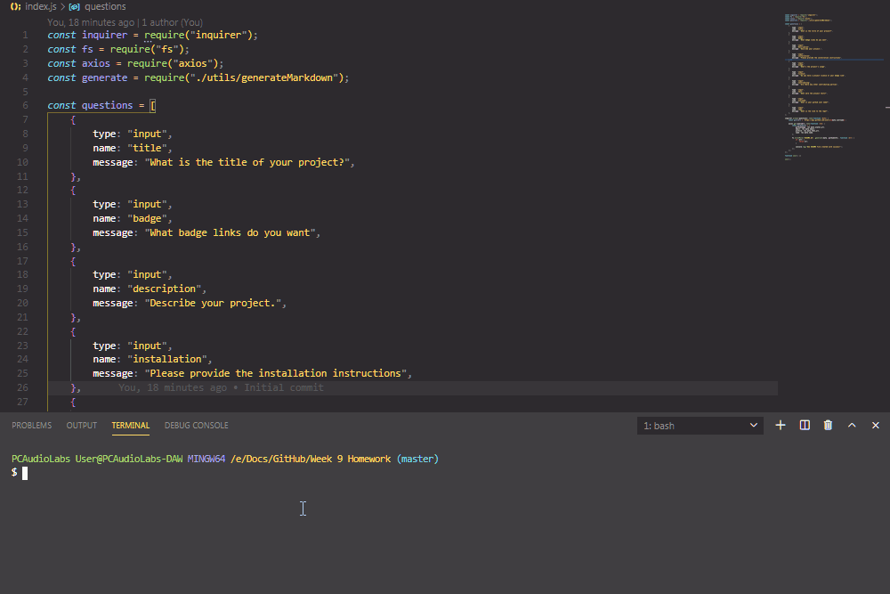

# **Unit 09 Node.js and ES6+ Homework: Good README Generator**

## Description

When creating an open source project on GitHub, it is important to have a quality README with information about the app--what is the app for, how to use the app, how to install it, how to report issues, and how to make contributions so that other developers are more likely to use and contribute to the success of the project. A command-line application will allow for quick and easy generation of a project README to get started quickly. This will allow a project creator to spend more time working on finishing the project and less time creating a good README.

### Application Functionality

## Table of contents

- [Description](#Description)
- [Usage](#Usage)
- [Repository Link](#Repository)
- [Contributors](#Contributors)
- [Test](#Test)
- [Licence](#Licence)
- [GitHub Info](#GitHub)

## Usage

This command-line application generates a README.md from a user's input. The application will begin when using the following command:

                node index.js

The user will be prompted for their information pertaining to the project the README is being created for.

## Repository

- [Project Repo](https://github.com/WasteOfADrumBum/README-Generator)

## Contributors

## Test

## Licence

## GitHub

- Joshua M. Small
- [GitHub Profile](https://github.com/WasteOfADrumBum)
